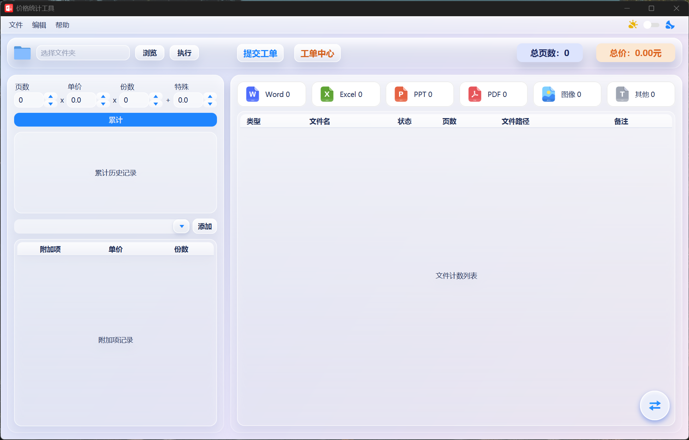
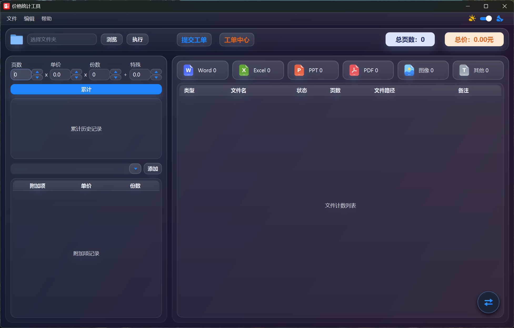

# PDFReaderV26

### 软件截图

### Ver 26.0.1
* 修复了附加选项表格的加减按钮，鼠标左键按完按右键无法释放连续点击事件的bug
* 修复了切换成跟随系统主题的错误，原主题管理器只符合Windows标准，现适配了MacOS和大部分Linux发行版（由JavaFX22+的Platform.Preferences实现）
* 优化了针对不同平台的处理逻辑，尽可能的仅排除转换PDF的功能
* 简化了弹窗深度，主窗口->二级窗口，不出现三级窗口
* 优化了用户体验，给出的提示不影响用户的其他操作
* 主窗口增加了主题切换的快捷入口
* 框架从iText切换成PDFBox，避免了iText的高危漏洞

### Ver 26.0.0
* 全功能适配仅支持Windows，但是除开Office转PDF之外，在MacOS和Linux使用正常

~~~
Office转PDF的功能在MacOS和Linux上无法做好格式的适配，Windows下可以调用com组件直接调用Office和WPS来实现，格式字体布局都可以完美的解析

方案一：就用纯Java去实现，转换做不到完美，格式尤其是字体很容易解析出乱码
方案二：在Windows/MacOS/Linux都安装LibreOffice，调用它的开源API去实现，问题同方案一，格式和字体无法完美解析
方案三：有商业方案，价格比较贵，接入挺方便的
~~~

* 从JDK8.0.501升级到JDK26.0.2 + JavaFX26.0.2
* 优化了老PDFReader的switch性能
* 改用util包的Preferences来持久化数据，是Java自带的轻量级框架，适配Windows/MacOS/Linux
* 优化了老PDFReader的一些处理逻辑，精简了部分代码，代码阅读性更好
* JavaFX26.0.2在权限，架构，渲染机制上都做了调整，文件计数列表的处理方式上做了调整，但是功能不变。其他功能和界面都已经复刻完成
* CSS样式统一性更高，精简了部分无用效果，降低了渲染性能开销
* TableCell的updateItem做了优化，在多数据的情况下，渲染性能会更好，做了预定义和去重处理
* TableView的修改和移除操作的数据刷新做了优化，极大减小了渲染开销